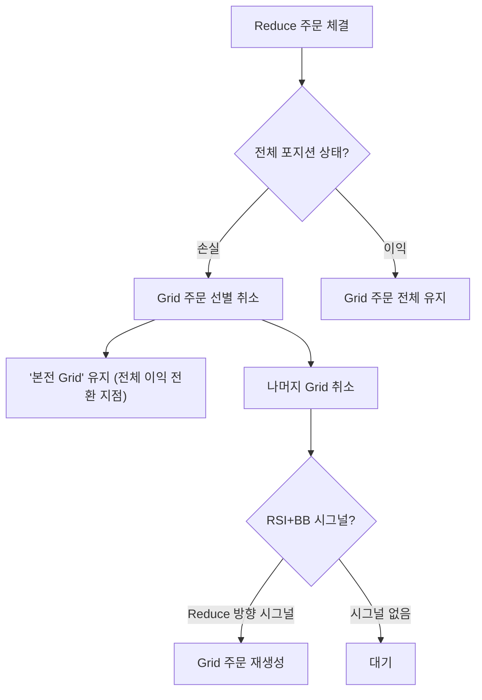

# 📊 Grid Profit 기능 구현 계획안

## 1. 문제 정의 (Current Problem)

현재 봇은 **전체 포지션이 이익일 때만** Reduce 주문을 체결하려고 합니다.
- 결과: 손실 상태에서는 호가 스프레드가 넓어지고, 체결이 안 되며, 계속 기다리기만 합니다.
- 예시: Short 재고가 $88,000에 쌓였는데, 가격이 $87,000으로 내려가도 "전체 손실"이라 매수(청산) 안 함.

## 2. 제안 솔루션: Grid Profit

**핵심 아이디어**: 전체 포지션 손익과 별개로, **각 거래(Grid) 단위의 이익**을 추적합니다.

### 2.1 Grid Profit 정의
```
Grid Profit = (마지막 Increase 주문 가격) - (현재 Reduce 주문 체결 가격)
```
- **Short 포지션**: Sell(Increase) @ $88,000 → Buy(Reduce) @ $87,500 = **+$500 Grid Profit** (per unit)
- **Long 포지션**: Buy(Increase) @ $85,000 → Sell(Reduce) @ $85,500 = **+$500 Grid Profit**

### 2.2 주문 배치 전략 변경 (Grid 생성 조건)

| 상황 | 현재 동작 | 변경 후 동작 |
|------|----------|-------------|
| **전체 포지션 손실** + Neutral | 스프레드 넓히고 대기 | **RSI+BB Reduce 시그널 시에만** Grid 생성 |
| **전체 포지션 손실** + Signal | 시그널 방향만 거래 | **RSI+BB Reduce 시그널 시** Grid 생성 ✅ |
| 전체 포지션 이익 | Grid 전체에 호가 | 동일 (변경 없음) |

> [!IMPORTANT]
> **핵심 조건**: 전체 포지션이 **손실 상태**일 때, **RSI+BB 조건이 Reduce 방향**으로 나타나면 Grid 주문을 생성합니다.
> - Short 보유 시 → **Buy 시그널** (RSI 과매도 + BB 하단) → Grid 매수 주문 생성
> - Long 보유 시 → **Sell 시그널** (RSI 과매수 + BB 상단) → Grid 매도 주문 생성


### 2.3 체결 후 주문 관리 (수정됨)



#### 핵심 변경:
1.  **'본전 Grid' 유지**: 손실 상태에서 Grid 체결 후, **전체 포지션을 이익으로 만들어주는 가격의 Grid 주문**은 취소하지 않고 유지합니다.
    - 예: Short 평단 $88,000, 현재 보유 0.005 BTC → "$87,500에 0.001 BTC 매수" 주문은 유지 (청산 시 전체 이익).
2.  **나머지 Grid 취소**: 본전 Grid 외의 주문은 취소하여 과도한 포지션 축적을 방지합니다.
3.  **시그널 시 재생성**: RSI+BB 조건이 Reduce 방향(예: Short 보유 시 Buy 시그널)으로 다시 나타나면, Grid 주문을 다시 생성합니다.


## 3. 대시보드 표시

### 3.1 새로운 Metric 추가

| 항목 | 설명 |
|------|------|
| **Realized PnL** | 기존: 완전 청산된 거래의 손익 |
| **Grid Profit** | 신규: Reduce 거래마다 발생하는 Grid 단위 이익 |
| **Cumulative Grid Profit** | 누적 Grid Profit |

### 3.2 Trade History 테이블 변경

기존 컬럼에 `Grid Profit` 컬럼 추가:
```
| Time | Action | Price | Amount | Realized PnL | Grid Profit |
|------|--------|-------|--------|--------------|-------------|
| ... | Reduce Short | $87,500 | 0.001 | $0.00 | +$0.50 |
```

## 4. 구현 상세

### 4.1 코드 변경 대상

| 파일 | 변경 내용 |
|------|----------|
| `strategies/market_maker.py` | Reduce 주문 배치 로직 변경, Grid Profit 계산 |
| `core/paper_exchange.py` | Grid Profit 추적 변수 및 저장 |
| `dashboard.py` | Grid Profit 표시 UI |
| `config.yaml` | `grid_profit_mode: true` 옵션 추가 |

### 4.2 데이터 구조 (신규)

```python
# paper_exchange.py 또는 market_maker.py
self.last_increase_price = None  # 마지막 Increase 주문 가격
self.cumulative_grid_profit = 0.0
```

### 4.3 Reduce 호가 배치 로직 (변경)

```python
# 손실 상태일 때
if unrealized_pnl < 0:
    # BB+RSI 시그널 지점에만 Reduce 호가 제시
    if regime == 'buy' and position < 0:  # Short 청산 시그널
        place_reduce_order(price=bb_lower, side='buy')
    elif regime == 'sell' and position > 0:  # Long 청산 시그널
        place_reduce_order(price=bb_upper, side='sell')
    # Neutral이면 주문 안 냄
else:
    # 이익 상태: 기존 Grid 로직 유지
    place_grid_orders(...)
```

## 5. 롤백 계획

현재 버전을 `v1.5.1-pre-gridprofit`으로 태그해두었습니다.
문제 발생 시:
```bash
git checkout v1.5.1-pre-gridprofit
```

---

## ✅ 검토 요청

위 계획이 의도하신 바와 맞는지 확인 부탁드립니다.
특히:
1. **Grid Profit 계산 공식**이 맞는지?
2. **손실 상태에서 Neutral일 때 주문을 안 내는 것**이 맞는지? (아니면 시그널 지점에는 내야 하나요?)
3. **체결 후 주문 취소 조건**이 맞는지?

승인해주시면 코딩을 시작하겠습니다.
