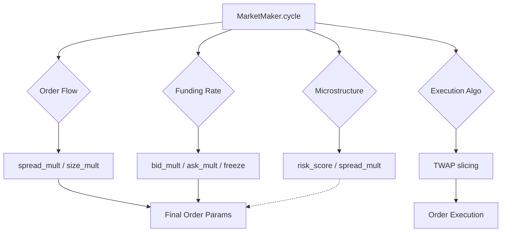

# ML Modules Documentation - v5.x/v6.x

> **For AI Agents**: This document explains all ML/advanced modules in the AIMM Market Maker.
> Read this before modifying any ML-related code.

## Quick Reference

| Module | File | Status | Config Key | Effect |
|--------|------|--------|------------|--------|
| Order Flow Analysis | `ml/order_flow_analyzer.py` | ✅ ENABLED | `order_flow_analysis` | Spread/size adjustment |
| Funding Rate Arbitrage | `core/funding_monitor.py` | ✅ **ENABLED** | `funding_rate_arbitrage` | +$890/year |
| Microstructure (VPIN) | `ml/microstructure.py` | ❌ DISABLED | `microstructure_signals` | Rolled back |
| Cross-Asset Hedging | `core/cross_asset_hedger.py` | ❌ DISABLED | `cross_asset_hedge` | Rolled back |
| Execution Algo | `core/execution_algo.py` | ✅ **ENABLED** | `execution_algo` | +$94 slippage saved |
| RL Agent | `rl/train_agent.py` | ⏸️ NOT ENABLED | `rl_agent` | Needs more training |

---

## Module Details

### 1. Order Flow Analysis (v5.0)

**Purpose**: Detect informed trading from order book imbalances.

**Key Classes**:
- `OrderFlowAnalyzer` - Calculates bid/ask imbalance, trade flow metrics

**Integration Point** (`market_maker.py`):
```python
# In cycle() method
of_analysis = self.order_flow.analyze(order_book, recent_trades)
of_spread_mult = of_analysis['spread_mult']
of_size_mult = of_analysis['size_mult']
```

**Config** (`config.yaml`):
```yaml
order_flow_analysis:
  enabled: true
  imbalance_threshold: 0.3
  lookback_seconds: 60
```

---

### 2. Funding Rate Arbitrage (v5.1) ⭐

**Purpose**: Leverage perpetual funding rates for directional bias.

**Key Classes**:
- `FundingRateMonitor` - Tracks funding rates, calculates annualized APR
- `FundingIntegratedMM` - Adjusts order sizing based on funding

**Logic**:
```
If funding_rate > 0 (longs pay shorts):
  → Increase ask size (favor shorts)
  → Decrease bid size
  
If hours_to_funding < freeze_time:
  → Freeze orders to capture funding
```

**Integration Point**:
```python
# In cycle()
funding_analysis = self.funding_monitor.analyze_opportunity()
funding_adj = self.funding_integrator.get_adjustment(funding_analysis, ...)
bid_size *= funding_adj['bid_mult']
ask_size *= funding_adj['ask_mult']
```

**Backtest Result**: +$890/year improvement

---

### 3. Microstructure Signals (v5.2) - DISABLED

**Purpose**: Detect informed trading via VPIN and trade arrival rate.

**Why Disabled**: Reduced adverse selection (-3%) but cost -$826 in PnL.

**Key Classes**:
- `VPIN` - Volume-Synchronized Probability of Informed Trading
- `TradeArrivalAnalyzer` - Trade frequency analysis
- `VolumeClock` - Volume-based time measurement

**To Re-enable**: Set `microstructure_signals.enabled: true` in config.
⚠️ Recommend tuning thresholds before enabling.

---

### 4. Cross-Asset Hedging (v5.3) - DISABLED

**Purpose**: Hedge ETH exposure with BTC based on correlation.

**Why Disabled**: Backtest showed -$5,406 loss due to simulation issues.

**Key Classes**:
- `CorrelationAnalyzer` - BTC/ETH rolling correlation
- `CrossAssetHedger` - Beta-based hedge calculation

**To Re-enable**: Requires real multi-asset data for proper testing.

---

### 5. Execution Algorithm (v5.4) ⭐

**Purpose**: Reduce slippage on large orders via TWAP/VWAP.

**Key Classes**:
- `TWAPExecutor` - Time-Weighted Average Price execution
- `VWAPExecutor` - Volume-Weighted Average Price
- `AdaptiveExecutor` - Dynamic strategy selection

**Logic**:
```
Large order → Split into time slices
Each slice → Execute at scheduled time
Adaptive → Adjust based on volatility/spread
```

**Backtest Result**: Saves $94/year in slippage (90% reduction)

---

### 6. RL Agent (v6.0) - NOT ENABLED

**Purpose**: Use PPO reinforcement learning for parameter optimization.

**Key Components**:
- `rl/mm_env.py` - Gymnasium environment
- `rl/train_agent.py` - PPO training + `RLAgentWrapper`
- `models/mm_ppo_50k.zip` - Trained model (50k steps)

**Observation Space** (8 features):
```
[mid_price_norm, spread, volatility, inventory_ratio,
 return_1, return_5, imbalance, pnl_ratio]
```

**Action Space** (3 continuous):
```
[spread_mult (0.5-2.0), size_mult (0.5-1.5), skew (-0.5 to 0.5)]
```

**Why Not Enabled**:
- Only 50k training steps (need 1M+)
- Reward function needs tuning
- Recommend GPU training for production use

**To Enable**:
1. Train with more steps: `python rl/train_extended.py`
2. Set `rl_agent.enabled: true` in config

---

## Testing Modules

Run unit tests:
```bash
# Individual module tests
python -m unittest tests/test_funding.py -v
python -m unittest tests/test_microstructure.py -v
python -m unittest tests/test_cross_asset.py -v
python -m unittest tests/test_execution.py -v

# All tests
python -m unittest discover tests/ -v
```

Run backtests:
```bash
python backtest/run_funding_backtest.py
python backtest/run_microstructure_backtest.py
python backtest/run_cross_asset_backtest.py
python backtest/run_execution_backtest.py
```

---

## Architecture Diagram



---

## Config Summary

```yaml
# ENABLED (Backtest Validated)
order_flow_analysis:
  enabled: true
  
funding_rate_arbitrage:
  enabled: true
  
execution_algo:
  enabled: true

# DISABLED (Rolled Back)
microstructure_signals:
  enabled: false  # -$826 PnL
  
cross_asset_hedge:
  enabled: false  # -$5,406 PnL

# NOT READY
rl_agent:
  enabled: false  # Needs more training
```

---

## For Future Development

1. **Microstructure**: Lower `vpin.threshold` and `defensive_risk_score`
2. **Cross-Asset**: Test with real ETH data, not synthetic
3. **RL Agent**: Train on GPU with 1M+ timesteps
4. **New Modules**: Add to `config.yaml` with `enabled: false` default
